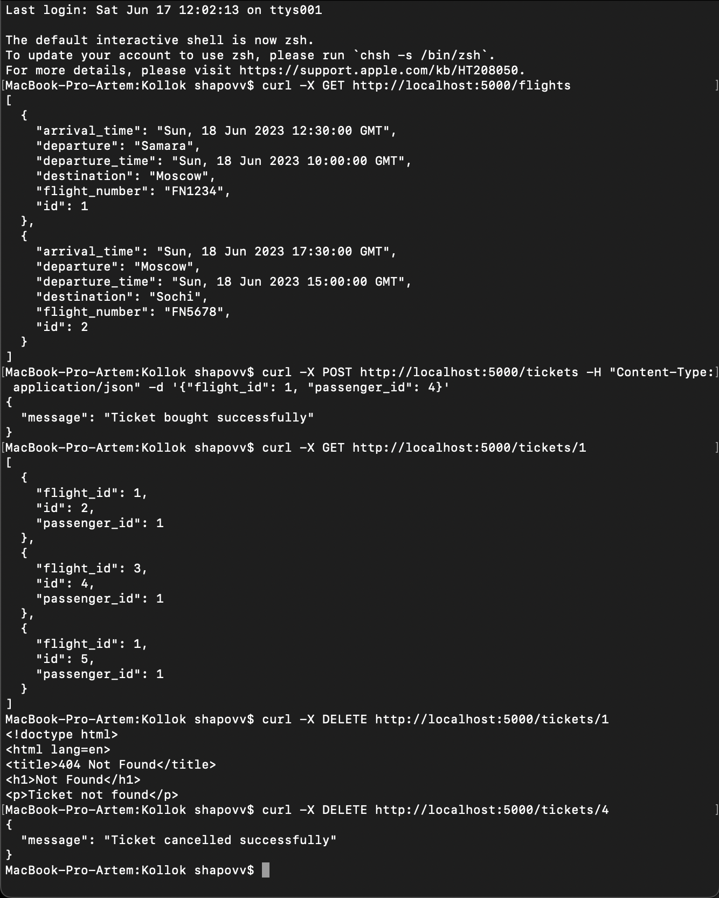
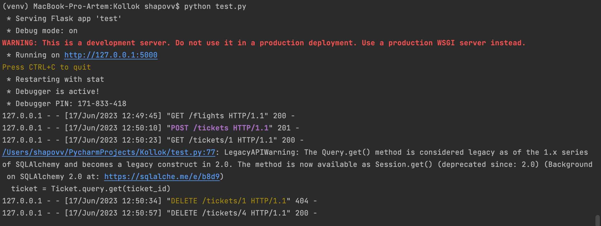

# Kollok

## Выполнил: Шаповалов Артём

Для запуска:
```с
python test.py
```


Примеры запросов:
```с
curl -X GET http://localhost:5000/flights
curl -X POST http://localhost:5000/tickets -H "Content-Type: application/json" -d '{"flight_id": 1, "passenger_id": 1}'
curl -X GET http://localhost:5000/tickets/1
curl -X DELETE http://localhost:5000/tickets/1
```

Проверка работы:



